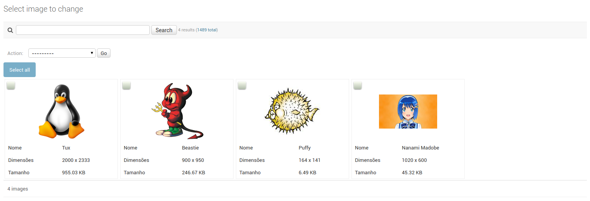

# Django Image Tileview
A simple Django Admin view for side by side image exibition.

## Motivation
We have a large number of images to manage, so the traditional listview was not very useful.

This is a simple modification, that enables us to see more images per page.

## Installation
Install from git:
```
pip install "git+git://github.com/collabo-br/django-image-tileview.git"
```

Add to your INSTALLED_APPS:

```python
INSTALLED_APPS = [
    ...
    'tileview',
]
```

## Usage
```python
from django.contrib import admin
from django.utils.safestring import mark_safe
from django.utils.translation import ugettext as _

from yourapp.models.image import Image

from tileview.admin import ImageTileAdminMixin

@admin.register(Image)
class ImageAdmin(ImageTileAdminMixin):

    list_display = (
        '_thumb_image',
        'name',
        '_image_geometry',
        '_image_size',
    )

    # we have a service that makes thumbnails and mantains a cache
    def _thumb_image(self, obj):
        return mark_safe(''.format(
            settings.IMAGE_THUMBNAIL_URL,
            obj.file.url
        ))
    _thumb_image.short_description = _('image')

    def _image_geometry(self, obj):
        try:
            return '{} x {}'.format(obj.image_width, obj.image_height)
        except:
            return '--'
    _image_geometry.short_description = _('dimensions')

    def _image_size(self, obj):
        try:
            return '{:.2f} KB'.format(obj.file.size / 1024.0)
        except:
            return '--'
    _image_size.short_description = _('size')
```

The first entry on ```list_display``` must be the image URL. All other fields will appear as properties on a table under the image.

**Image width and height are hardcoded in ```tileview.css``` file!**


## Result:



## I have some awesome idea, can I help?

Of couse! That's why it is on github, feel free to make forks and pull requests!

## TODO
* Need tests, coverage, etc
* Better selection, with selection count, select all images from all pages, etc
* Make image and image card width and height configurable
